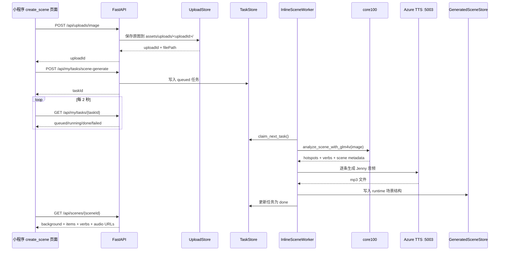

# 当前项目整体功能与代码结构说明

更新时间：2026-04-04 12:41 UTC

本文说明当前 `/www/wwwroot/e.cps.vin/weixin-demo-01` 这套系统是如何工作的，重点覆盖：

- 小程序前端页面如何组织
- 前端如何调用后端 API
- 后端如何保存公开场景、上传文件、任务状态、生成场景
- `core100` 如何参与图片分析和音频生成
- VPS 上的 `Nginx + systemd + FastAPI` 如何协同

## 1. 当前系统做了什么

当前系统已经能完成两条业务主线：

1. 公开场景浏览
   - 小程序访问公开场景库
   - 打开 `scene_breakfast`、`scene_zoo`
   - 显示背景图、热点区域、动词条、音频

2. 私人场景生成
   - 小程序拍照或上传图片
   - 图片上传到后端
   - 后端创建异步任务
   - 后端 worker 调用 `core100` 分析图片，生成热点 JSON
   - worker 调用本机 `5003` 的 Azure TTS 生成 Jenny 音色 mp3
   - worker 把结果适配成当前小程序 runtime 可直接消费的场景结构
   - 小程序轮询任务状态
   - 任务完成后，用户直接打开新生成的私人场景

## 2. 系统总览图

```mermaid
flowchart LR
  A[微信小程序前端] --> B[FastAPI /api]
  B --> C[公开场景 JSON\nbackend/data/scenes.json]
  B --> D[上传索引\nbackend/data/uploads.json]
  B --> E[任务索引\nbackend/data/tasks.json]
  B --> F[生成场景索引\nbackend/data/generated_scenes.json]
  B --> G[assets 目录\n图片/音频/上传文件/生成文件]
  B --> H[InlineSceneWorker]
  H --> I[/www/wwwroot/e.cps.vin/core100]
  H --> J[127.0.0.1:5003 Azure TTS]
  K[Nginx https://e.cps.vin] --> B
  L[systemd weixin-demo-api.service] --> B
```

## 3. 一次“生成私人场景”的完整时序



## 4. 目录结构图

当前真正参与运行的核心目录大致如下：

```text
weixin-demo-01/
├── app.js                         # 小程序全局启动，初始化 debugUserId
├── app.json                       # 小程序页面注册
├── app.wxss                       # 全局样式
├── assets/
│   ├── images/                    # 公开场景背景图
│   ├── audio/                     # 公开场景音频
│   ├── uploads/                   # 用户上传原图
│   └── generated/                 # 生成场景背景图和 mp3
├── backend/
│   ├── app/
│   │   ├── main.py                # FastAPI 入口
│   │   ├── settings.py            # 目录和环境配置
│   │   ├── scene_store.py         # 公开场景读取
│   │   ├── upload_store.py        # 上传文件索引与落盘
│   │   ├── task_store.py          # 生成任务索引与状态流转
│   │   ├── generated_scene_store.py
│   │   ├── scene_adapter.py       # core100 -> 小程序 runtime 协议适配
│   │   ├── worker_runner.py       # 后台 worker
│   │   └── schemas.py             # 请求 DTO
│   ├── data/
│   │   ├── scenes.json            # 公开场景
│   │   ├── uploads.json           # 上传记录
│   │   ├── tasks.json             # 任务记录
│   │   └── generated_scenes.json  # 私人场景记录
│   ├── requirements.txt
│   └── start-api.sh
├── config/
│   └── runtime.js                 # 小程序 API 基础地址
├── pages/
│   ├── home/                      # 首页
│   ├── library/                   # 场景库页
│   ├── create_scene/              # 上传并生成场景
│   ├── my_scenes/                 # 我的私人场景
│   ├── scene_runtime/             # 统一场景详情页
│   └── shared/                    # runtime 公共逻辑和模板
├── services/
│   ├── api.js                     # wx.request 封装
│   ├── upload.js                  # wx.uploadFile 封装
│   ├── task.js                    # 任务接口封装
│   ├── scene.js                   # 场景接口封装
│   └── config.js
└── docs/
    └── *.md                       # 交接文档、设计文档、调试文档
```

补充：

- 生成引擎不在本仓库内，而是在 `/www/wwwroot/e.cps.vin/core100`
- 站点代理配置在 `/www/server/panel/vhost/nginx/e.cps.vin.conf`
- systemd 服务单元在 `/etc/systemd/system/weixin-demo-api.service`

## 5. 前端目录如何工作

### 5.1 小程序全局层

关键文件：

- `app.js`
- `app.json`
- `config/runtime.js`
- `services/api.js`

作用：

- `app.js`
  - 启动时生成或读取 `debugUserId`
  - 这个值会持久化到本地 storage
  - 目的是让当前设备/当前调试用户拥有自己的私人场景视图

- `config/runtime.js`
  - 指定默认 API 地址是 `https://e.cps.vin/api`

- `services/api.js`
  - 把所有 `wx.request` 统一封装
  - 自动附带 `Authorization`
  - 自动附带 `X-Debug-User-Id`
  - 统一解析 `{ code, data }` 风格响应

- `app.json`
  - 当前注册页面为：
    - `pages/home/index`
    - `pages/library/index`
    - `pages/create_scene/index`
    - `pages/my_scenes/index`
    - `pages/scene_runtime/index`

### 5.2 首页

目录：

- `pages/home/`

作用：

- 提供几个主入口：
  - 公开场景库
  - 拍照生成我的场景
  - 我的生成场景
  - 直接打开早餐场景

这个页面本身不请求后端，只是导航入口。

### 5.3 场景库页

目录：

- `pages/library/`

作用：

- 同时拉两份列表：
  - `GET /api/scenes`
  - `GET /api/my/scenes`

- 页面上分成两块展示：
  - 我的生成场景
  - 公开场景

这样用户不需要先跳到“我的场景”页，也能直接看到刚生成完成的场景。

### 5.4 创建场景页

目录：

- `pages/create_scene/`

作用：

- 用 `wx.chooseMedia` 选择图片
- 用 `services/upload.js` 调 `POST /api/uploads/image`
- 用 `services/task.js` 调 `POST /api/my/tasks/scene-generate`
- 保存返回的 `taskId`
- 以 2 秒轮询 `GET /api/my/tasks/{taskId}`
- 如果任务完成，就拿到 `sceneId`
- 用户点击“打开新场景”跳到统一 runtime 页

这就是当前“拍照/上传 -> 提交生成 -> 轮询 -> 打开场景”的主页面。

### 5.5 我的场景页

目录：

- `pages/my_scenes/`

作用：

- 调 `GET /api/my/scenes`
- 只显示当前 `debugUserId` 对应的私人场景
- 点击后进入统一 runtime 页面

### 5.6 统一场景详情页

目录：

- `pages/scene_runtime/`
- `pages/shared/scene-page.js`
- `pages/shared/scene-template.wxml`
- `pages/shared/scene.wxss`

作用：

- 不区分“公开场景”和“私人场景”
- 页面只认统一协议：
  - `sceneId`
  - `title`
  - `background`
  - `items`
  - `verbs`
  - `audio`

也就是说，只要后端能返回这种结构，前端就能直接渲染。

这个设计很重要，因为它把“静态页时代的一页一个场景”改成了“动态 runtime 一页承载所有场景”。

## 6. 后端目录如何工作

### 6.1 FastAPI 入口

文件：

- `backend/app/main.py`

核心职责：

- 暴露 API
- 挂载 `/assets`
- 启动 inline worker
- 把磁盘里的内部数据结构序列化成前端可消费的响应结构

当前主要接口如下：

```text
GET  /api/health
GET  /api/scenes
GET  /api/scenes/{sceneId}
GET  /api/my/scenes
POST /api/uploads/image
POST /api/my/tasks/scene-generate
GET  /api/my/tasks/{taskId}
```

其中：

- `GET /api/scenes`
  - 读公开场景

- `GET /api/my/scenes`
  - 读当前用户的私人场景

- `GET /api/scenes/{sceneId}`
  - 先查公开场景
  - 查不到再查私人场景
  - 如果是私人场景，会校验 `ownerId == X-Debug-User-Id`

### 6.2 配置层

文件：

- `backend/app/settings.py`

负责统一定义：

- 仓库根目录
- `assets/`
- `backend/data/`
- `core100` 根目录
- `PUBLIC_BASE_URL`
- `CORE100_MODEL`
- `CORE100_TTS_URL`
- `ZHIPUAI_API_KEY`

这让代码里不需要到处硬编码路径。

### 6.3 公开场景存储

文件：

- `backend/data/scenes.json`
- `backend/app/scene_store.py`

作用：

- 存放公开场景，比如早餐和动物园
- 这是“系统内置内容”
- 小程序的公开场景库直接来源于这里

### 6.4 上传文件存储

文件：

- `backend/app/upload_store.py`
- `backend/data/uploads.json`
- `assets/uploads/`

作用：

- 接收用户上传图片
- 把原图落盘到：
  - `assets/uploads/<uploadId>/source.jpg`
  - 或其他原始后缀
- 把索引信息写入 `uploads.json`

索引里会保留：

- `uploadId`
- `ownerId`
- `originalFilename`
- `filePath`
- `width`
- `height`

### 6.5 任务存储

文件：

- `backend/app/task_store.py`
- `backend/data/tasks.json`

作用：

- 生成任务先写入 `tasks.json`
- 初始状态是 `queued`
- worker 抢到后改成 `running`
- 最终变成 `done` 或 `failed`

典型状态字段：

- `status`
- `step`
- `progress`
- `sceneId`
- `errorMessage`

这就是前端轮询能看到的全部内容。

### 6.6 生成场景存储

文件：

- `backend/app/generated_scene_store.py`
- `backend/data/generated_scenes.json`
- `assets/generated/`

作用：

- 把 `core100` 生成后的最终场景写成可复用索引
- 同时把背景图和音频资源放到 `assets/generated/<sceneId>/`

生成完成后，前端访问新场景不需要再回跑一遍分析，而是像访问普通场景一样直接读取结果。

### 6.7 协议适配层

文件：

- `backend/app/scene_adapter.py`

这是当前架构里最关键的一层。

原因：

- `core100` 输出的字段格式不是小程序 runtime 直接吃的格式
- 小程序 runtime 只认当前后端协议

适配层负责做这些转换：

- `sentence_translation` -> `sentenceTranslation`
- hotspot/verb 原始字段 -> runtime 条目结构
- 坐标值做百分比限制和规范化
- 把音频文件名挂成 `audioPath`
- 补齐场景 `meta`

所以：

- `core100` 是生成引擎
- `scene_adapter.py` 是协议边界
- `scene_runtime` 是统一消费者

## 7. worker 如何驱动生成任务

文件：

- `backend/app/worker_runner.py`

当前用的是进程内后台线程，不是单独 Celery/RQ 进程。

运行逻辑如下：

1. 启动时 `scene_worker.start()`
2. 循环检查 `tasks.json`
3. 找到第一个 `queued` 任务
4. 读取对应上传图片
5. 复制原图到 `assets/generated/<sceneId>/background.xxx`
6. 调 `core100/analyze_scene.py`
7. 得到热点和动词结构
8. 调 `core100/generate_audio.py`
9. 它再调用 `127.0.0.1:5003`
10. 生成 mp3 到 `assets/generated/<sceneId>/`
11. 调 `scene_adapter.py` 组装最终场景
12. 写入 `generated_scenes.json`
13. 把任务改成 `done`

如果任何一步报错：

- 任务会被写成 `failed`
- `errorMessage` 会返回给前端轮询页

## 8. `core100` 在哪里，扮演什么角色

`core100` 不在本仓库内部，而是在：

```text
/www/wwwroot/e.cps.vin/core100
```

它当前承担两件事：

1. 图片分析
   - 主要入口：`analyze_scene.py`
   - 能识别热点对象、句子、坐标、可选动词

2. 音频生成
   - 主要入口：`generate_audio.py`
   - 会按词和例句生成 mp3
   - 默认现在是走 Jenny 音色

本项目并不让小程序直接碰 `core100`。

真正的边界关系是：

```text
小程序 -> FastAPI -> worker -> core100 -> worker -> FastAPI协议 -> 小程序
```

这样做的好处是：

- 前端协议稳定
- 以后换模型或换 TTS，不需要重写小程序页面
- `core100` 可以继续独立演进

## 9. 资源文件是如何组织的

### 9.1 公开资源

```text
assets/images/*.jpg
assets/audio/<scene>/*.mp3
backend/data/scenes.json
```

特点：

- 由仓库维护
- 用于公开场景
- 版本可控

### 9.2 用户上传资源

```text
assets/uploads/<uploadId>/source.jpg
backend/data/uploads.json
```

特点：

- 原始输入
- 后续由 worker 继续消费

### 9.3 生成结果资源

```text
assets/generated/<sceneId>/background.jpg
assets/generated/<sceneId>/*.mp3
backend/data/generated_scenes.json
```

特点：

- 最终给小程序消费
- 与公开场景采用同一种 runtime 协议

## 10. VPS 上的部署链路

当前线上访问路径如下：

```text
微信小程序
  -> https://e.cps.vin/api/*
  -> Nginx
  -> 127.0.0.1:8000 FastAPI
  -> /assets 由 FastAPI 挂载静态目录
```

部署上涉及三部分：

1. `systemd`
   - 服务名：`weixin-demo-api.service`
   - 负责常驻运行 FastAPI

2. `Nginx`
   - 负责 HTTPS 入口
   - 反代：
     - `/api/`
     - `/assets/`

3. FastAPI
   - 处理业务接口
   - 静态暴露 `assets/`

这意味着：

- 小程序永远只看到 `https://e.cps.vin`
- 它不会直接访问本机端口

## 11. 当前最重要的架构特点

### 11.1 已经从“静态页面项目”演进成“运行时驱动项目”

之前是：

- 每个场景一个页面
- 数据写死在前端

现在是：

- 所有场景都进入统一 runtime 页
- 场景内容来自后端 API

### 11.2 公开场景和私人场景共用同一套渲染协议

这点非常重要。

因为：

- 公开场景来自 `backend/data/scenes.json`
- 私人场景来自 `generated_scenes.json`
- 但前端完全不需要知道来源差异

它只看同一个结构：

```json
{
  "sceneId": "scene_xxx",
  "title": "标题",
  "background": "https://e.cps.vin/assets/...",
  "items": [],
  "verbs": [],
  "meta": {}
}
```

### 11.3 当前的“用户体系”仍是调试态

当前私人场景隔离是基于：

- `X-Debug-User-Id`

也就是说：

- 现在不是正式登录系统
- 只是先通过设备本地生成的 `debugUserId` 把数据隔开

这适合当前联调阶段。

以后如果接正式账号体系，只需要把：

- `get_current_user_id()`

从“读 debug header”改成“读真实登录态”。

## 12. 当前一次成功生成场景，实际落了哪些东西

如果你在真机上成功生成了一个场景，后台通常会同时新增这些数据：

```text
assets/uploads/<uploadId>/source.xxx
assets/generated/<sceneId>/background.xxx
assets/generated/<sceneId>/*.mp3
backend/data/uploads.json
backend/data/tasks.json
backend/data/generated_scenes.json
```

也就是说，一次生成结果并不是临时内存数据，而是已经落盘并可复用的。

## 13. 后续如果继续扩展，应该优先沿着哪条线走

最自然的下一步是：

1. 把当前 debug 用户体系替换成正式登录用户体系
2. 把 JSON 索引存储替换成数据库
3. 把 inline worker 替换成独立异步 worker
4. 增加任务取消、失败重试、历史任务页
5. 给生成场景增加编辑能力
   - 改标题
   - 调整热点框
   - 重生成单条音频

但在当前阶段，这套实现已经足够支持：

- 真机上传图片
- 后端分析生成
- 私人场景查看
- 公开场景和私人场景共存联调

## 14. 一句话总结

当前系统本质上是：

“一个用微信小程序做前端、用 FastAPI 做协议与存储层、用 `core100` 做场景生成引擎、用本机 Azure TTS 做音频服务、最终把所有结果统一投喂给同一个 runtime 场景页的动态英语场景系统。”
